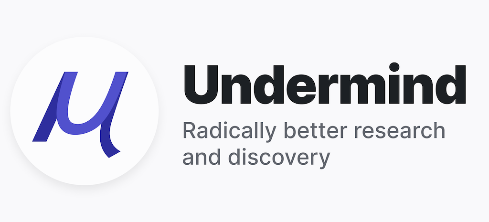
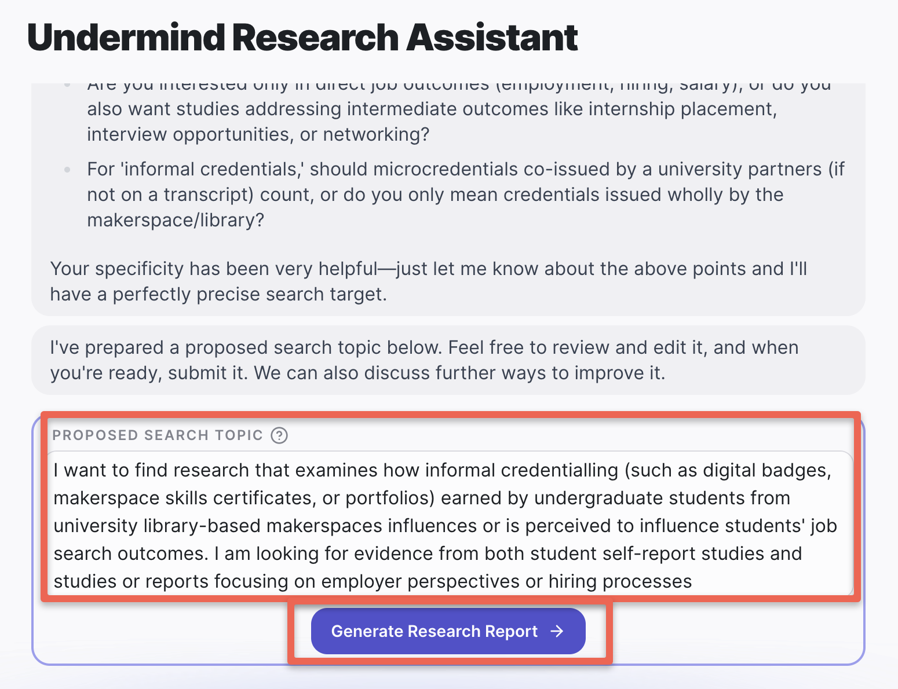
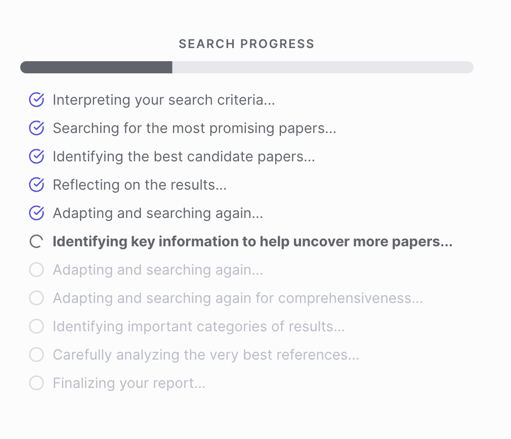
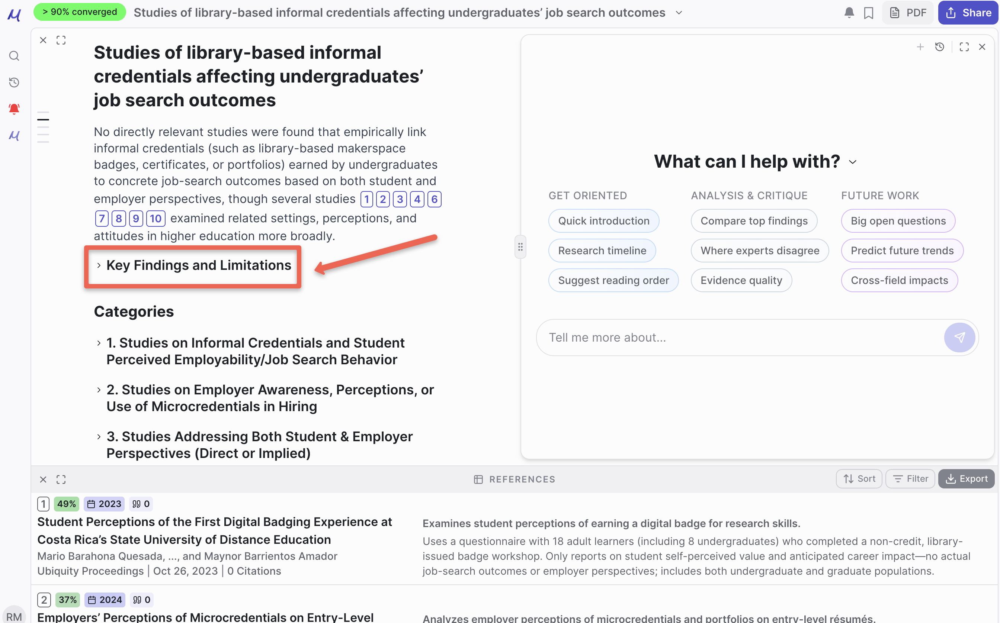
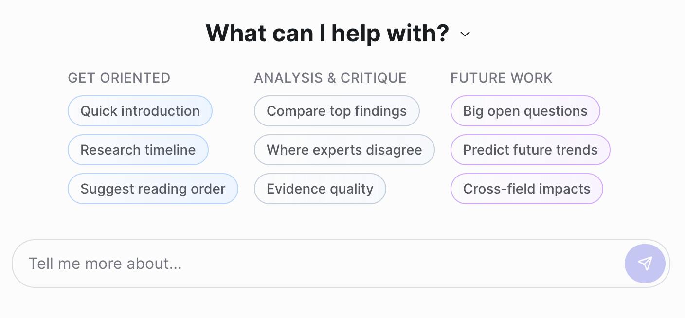

# Undermind.ai
## Three gentle reminders before you start:


- Undermind.ai is a research assistant that employs both AI and GenAI to help you find articles relevant to your research questions. It uses AI tools to find related articles and then uses GenAI to summarize the contents of resources.
- **As always with GenAI summaries, you can't depend on the summaries being 100% accurate all the time!** Please read the underlying articles and **only quote or summarize information from the underlying article**.
-  Undermind.ai is a useful tool, but please remember that it doesn ot have access to the whole universe of journal articles and peer-reviewed resources. The primary source of its training data sources is the [Semantic Scholar](https://www.semanticscholar.org/){:target="_blank"} which is database of select academic journals, so you'll want to use other tools in conjunction with Undermind.ai, like [Google Scholar](https://scholar.google.ca/){:target="_blank"} for example, so that you don't miss any important papers on your research topic that Undermind.ai does not have access to.
- **When you sign up to access Undermind.ai, you are given 2 free "deep" searches that search the full text of all the articles.** After that, unless you sign up for their paid level of service, Undermind.ai only searches the abstracts of articles to respond to your request and not the full text.

If you have any questions or get stuck as you work through this in-class GenAI exercise, please ask the instructor for assistance.  Have fun!

***

1. Let’s begin to do a search in Undermind.ai on the same topic, this time using natural language rather than just keywords.
  - Open [Undermind.ai](https://www.undermind.ai/){:target="_blank"}, and if you want to use it, you’ll need to create an account.
  - Type the following into the search bar and **click the search button**:
<br>```How useful is informal credentialling for academic makerspace skills in student job searches?```<br>
  - Undermind will prompt you to "sharpen" your search by asking you some follow-up questions. You are not required to answer them, but you will likely get more relevant results if you do follow the suggestions. Copy and paste the following into the text box and then press **Enter** on your keyboard:
<br>```I am primarily interested in undergraduate students who have earned informal credentials from a university library-based makerspace. Provide evidence from both student self-report studies and employer-focused studies.```<br>
  - You will be given additional suggestions on how to refine your search prompt, but for now, scroll down the web page and read the "Proposed Search Topic." If the search topic looks reasonable to you, press the **Generate Research Report** button at the bottom of the page.<br>
<br>

  - The report should take between 5 and 8 minutes to generate. You can track the progress of what it's working on by monitoring the "Search Progress" on the right half of the page.
  - You can also see an "example report" by clicking on the **See an example report** purple button towards the right side of the page while you wait for your report to be generated.
  - Please remember that
2. Let's look at the report results!
  - **Discuss results with an expert**: If you have any follow up questions that came to mind while you were waiting for the report to generate, you can ask them here. Don't feel the need to ask them right away, as you can always ask them later. Based on the results, you could ask a follow-up question like this: ```Are there empirical studies that look at the students' perspective on how effective they think informal credentials are in helping them get a job?```
  - **Key Findings & Limitations**: This section is created by Generative AI, so care should be taken to verify claims by going to the source document. Note that there are links after every claim to the papers that Undermind used as sources.
    - Please click on one of the citation links and see if you can find where the source for the claim is in the journal article cited. Did you find it?<br>
    - Are the articles published in respected journals?
    - Do you notice any high-quality articles that you already know about that are missing? If you used the provided search, there is at least one article that is missing: [Makerspace Workshop Badges: Student Perceptions & Uses of Informal Credentialing](https://ijamm.pubpub.org/pub/w2c3tfk4){:target="_blank"}
<br>
  - **Categories**: 
  - **Timeline**: 
  - **Foundational work**: 
  - **Adjacent work**: 
  - **References**: <br>
<br>
  - **Undermind followup queries**: 
3. Reflection time:
>  - How useful do the articles look for your search?
>  - Compared to the Google Scholar results how high is the quality of the articles Elicit found?
>  - Does the combined 4 article summary look reasonable?
>  - How can you verify the accuracy of the summary?
>  - Does this look like a tool that could help you with your research?

[NEXT STEP: Cite Correctly](9-cite.html){: .btn .btn-blue }
