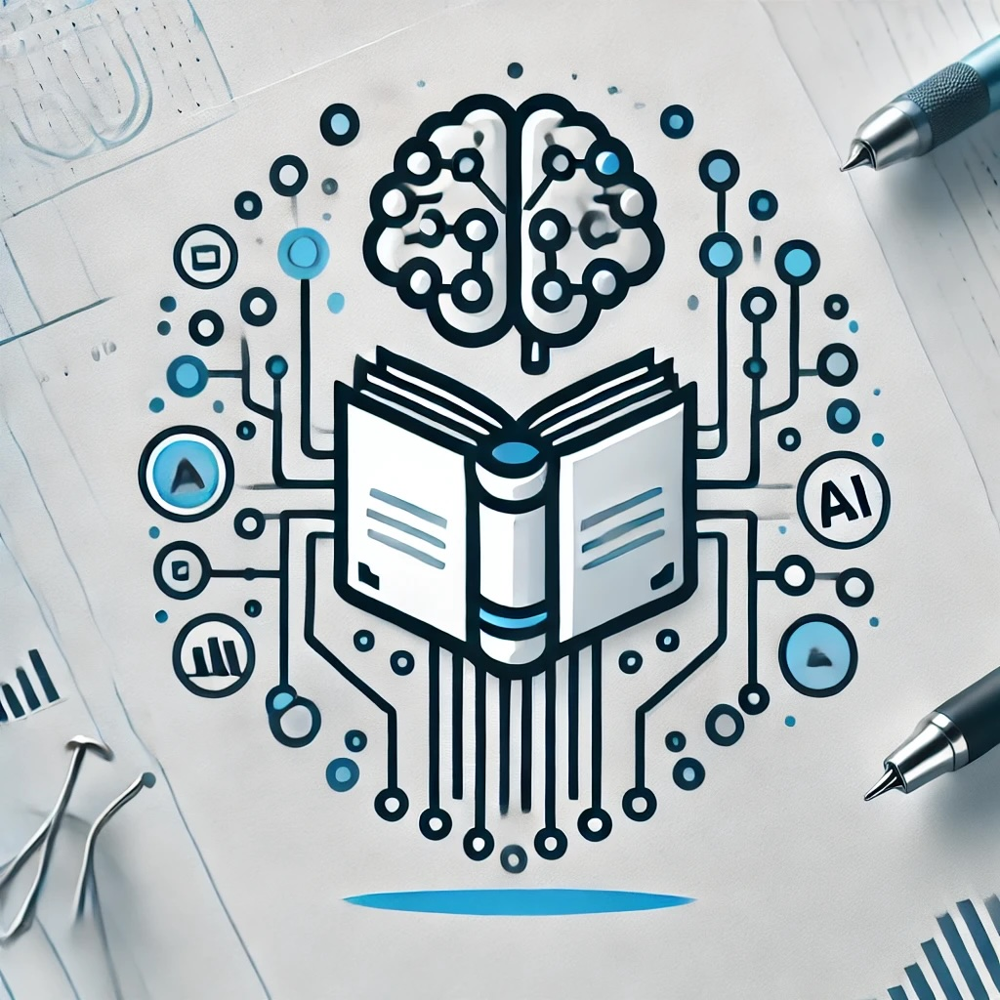

# AI Tools for Literature Reviews (Introduction)

- Pre-workshop activities: 10 min 
- Introductory presentation: 10 min
- Hands-on activities: 40 min

## About the Workshop 

Workshop participants will explore the use of Generative AI (GenAI) to assist with Student Research for idea generation, and literature reviews, and consider ethical considerations such as plagiarism, privacy, and research integrity. Participants will gain a basic understanding of GenAI and the ethical implications of its use in student research. In the hands-on portion of the workshop, participants will explore GenAI tool usage and output evaluation for accuracy and biases. The workshop will also cover UVic policies, attribution methods, library resource integration, and campus support services, to encourage informed, responsible GenAI use.

## Learning objectives

At the end of this workshop, you will be able to:

1. Ethical Considerations: Discuss the ethical implications of using GenAI in academic work, including issues related to plagiarism, data privacy, and research integrity.
2. Apply strategies such as critical review of terms and conditions, and adjustments to privacy settings to address AI ethics and safety issues.
3. Identify specific use cases for a range of AI tools for literature reviews.
4. Demonstrate how to use AI tools effectively for literature reviews and other research purposes
5. Evaluate Quality and Reliability: Critically evaluate the outputs of AI tools, including assessing accuracy, relevance, and potential biases.
6. Attribution: Cite outputs from GenAI tools using APA, MLA, IEEE, or other citation styles.
 
[NEXT STEP: Pre-Workshop Activities](pre-workshop.html){: .btn .btn-blue }

## Generative AI Workshop Pathway

This workshop is part of our Generative AI Workshop Pathway. The Pathway workshops are designed to help subject area experts and non-experts, and help meet the needs of students, faculty, & staff by offering foundational to advanced research & productivity skills training:

- **[GenAI Introductory Workshops](https://uviclibraries.github.io/genai-pathway/#introductory-workshops){:target="_blank"}**
- **[GenAI Intermediate Workshops](https://uviclibraries.github.io/genai-pathway/#intermediate-workshops){:target="_blank"}**
- **[GenAI Advanced Workshops](https://uviclibraries.github.io/genai-pathway/#intermediate-workshops){:target="_blank"}**
